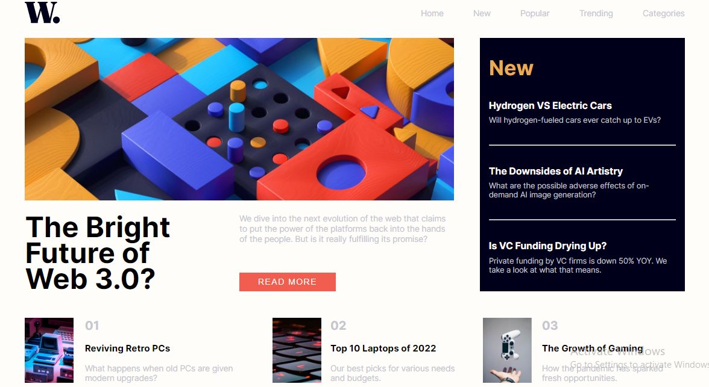
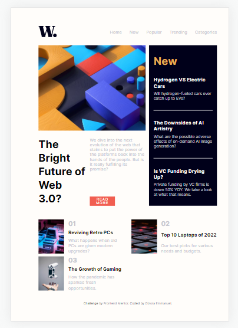

# Frontend Mentor - News homepage solution

This is a solution to the [News homepage challenge on Frontend Mentor](https://www.frontendmentor.io/challenges/news-homepage-H6SWTa1MFl). Frontend Mentor challenges help you improve your coding skills by building realistic projects.

## Table of contents

- [Overview](#overview)
  - [The challenge](#the-challenge)
  - [Screenshot](#screenshot)
  - [Links](#links)
- [My process](#my-process)
  - [Built with](#built-with)
  - [What I learned](#what-i-learned)
- [Author](#author)

## Overview

This project involve the development of a news homepage that showcase the use of elements such as, div, flex, grid and many more in order to give a beautiful rendation on how a news home page should look like.

### The challenge

Users should be able to:

- View the optimal layout for the interface depending on their device's screen size
- See hover and focus states for all interactive elements on the page

### Screenshot






### Links

- Solution URL: [Github Repository](https://github.com/Emmanuel-obiora/news-homepage-panther)
- Live Site URL: [news-homepage-panther](https://emmanuel-obiora.github.io/news-homepage-panther/)

## My process

1. First I created a repository on Github and then cloned it on my local machine.

2. I read and studied the challenge guidlines in terms of style-guide, font, assets provided, design flow.

3. After which I analyzed my code structure in my head, before creating the HTML code template step by step. Each line of code written was styled immediately to avoid unforseen bugs.

4. After achieving the Desktop design, I went on to effectively add the responsiveness for both tablet and mobile. All it required was a little twick to the css properties of some HTML elements.

5. For mobile device, the origin navigation menu was restyled to suit the device as such a littile bit of JavaScript was required to call up the hidden navigation menu.

6. Furthermore, I went over the code to check for bugs using live-server. With no bug on sight I published the completed design using Github pages.

### Built with

- Semantic HTML5 markup
- CSS custom properties
- Flexbox
- CSS Grid
- JavaScript

### What I learned

I have been prohramming for some months now, so the challenge looked a little too simple, but I became familiar with the inter google font template.

```html
<h1>Some HTML code I'm proud of</h1>
  <div class="toggle" onclick="openModal()">
    
  </div>
```

```css
::-webkit-scrollbar{
    width: 1em;
}

::-webkit-scrollbar-track{
    background-color: var(--color-bg);
    border-radius: 5px;
}

::-webkit-scrollbar-thumb{
    background-color: var(--color-grey);
    border-radius: 15px;
    border: 5px solid var(--color-bg);
}
```

```js
function openModal(){
    const open = document.getElementById('modalLock');
    const navs = document.getElementById('hideNav');

    open.classList.add('open-modal');
    navs.classList.add('show-nav');

}
```

## Author

- Website - [Obiora Emmanuel](https://emmanuel-obiora.github.io/portfolio-about-me-/web-content/)
- Frontend Mentor - [@Emmanuel-obiora](https://www.frontendmentor.io/profile/Emmanuel-obiora)
- Twitter - [@Miroclesdgenius](https://twitter.com/Miroclesdgenius)
